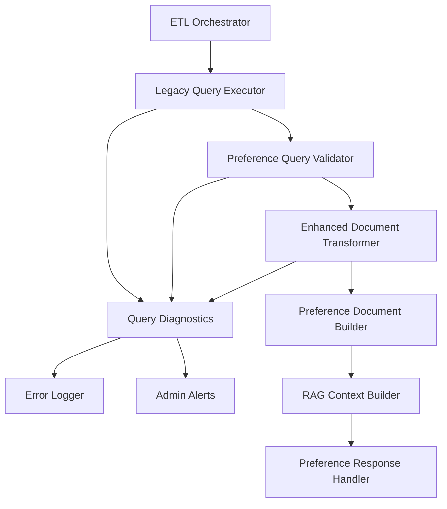

# Design Document

## Overview

This design addresses the missing PREFERENCE_ANALYSIS document generation in the ETL pipeline. The issue occurs because preference-related queries (imagePreferenceStatsQuery, preferenceDataQuery, preferenceJobsQuery) either fail to execute properly or return empty results, causing the document transformer to generate placeholder messages instead of meaningful preference analysis content.

## Architecture

### Current Issue Analysis

1. **Query Execution Problems**: Preference queries may be failing silently or returning empty results
2. **Data Validation Issues**: Query results may not pass validation checks in the document transformer
3. **Fallback Logic Problems**: When preference data is missing, the system creates unhelpful placeholder documents
4. **Error Handling Gaps**: Preference query failures are not properly logged or diagnosed

### Proposed Solution Architecture



## Components and Interfaces

### 1. Enhanced Preference Query Execution

**Purpose**: Improve reliability and diagnostics for preference-related database queries.

**Key Improvements**:
- Add detailed logging for each preference query execution
- Implement query-specific error handling and retry logic
- Add data quality validation for preference query results
- Provide diagnostic information for empty or invalid results

**Interface**:
```python
class EnhancedPreferenceQueryExecutor:
    async def execute_preference_queries(self, anp_seq: int) -> PreferenceQueryResults
    async def validate_preference_data(self, query_results: Dict) -> ValidationReport
    async def diagnose_preference_issues(self, anp_seq: int) -> DiagnosticReport
```

### 2. Improved Document Transformation Logic

**Purpose**: Create meaningful PREFERENCE_ANALYSIS documents even with partial or missing data.

**Key Features**:
- Intelligent fallback when some preference data is missing
- Create informative documents explaining data availability
- Separate handling for different types of preference data
- Better error messages for users and administrators

**Interface**:
```python
class ImprovedPreferenceDocumentBuilder:
    def build_preference_documents(self, query_results: Dict) -> List[TransformedDocument]
    def create_partial_preference_document(self, available_data: Dict) -> TransformedDocument
    def create_informative_fallback_document(self, missing_queries: List[str]) -> TransformedDocument
```

### 3. Preference Data Validation Service

**Purpose**: Validate preference query results and provide detailed feedback on data quality.

**Interface**:
```python
class PreferenceDataValidator:
    def validate_image_preference_stats(self, data: List[Dict]) -> ValidationResult
    def validate_preference_data(self, data: List[Dict]) -> ValidationResult
    def validate_preference_jobs(self, data: List[Dict]) -> ValidationResult
    def generate_validation_report(self, all_results: Dict) -> ValidationReport
```

### 4. Enhanced RAG Integration

**Purpose**: Improve AI responses for preference-related questions with better context handling.

**Key Features**:
- Detect preference-related questions accurately
- Handle partial preference data gracefully
- Provide helpful alternatives when preference data is missing
- Avoid hallucination about non-existent preference results

## Data Models

### PreferenceQueryResults
```python
@dataclass
class PreferenceQueryResults:
    image_preference_stats: Optional[List[Dict]]
    preference_data: Optional[List[Dict]]
    preference_jobs: Optional[List[Dict]]
    execution_status: Dict[str, QueryExecutionStatus]
    validation_results: Dict[str, ValidationResult]
    diagnostic_info: DiagnosticInfo
```

### ValidationResult
```python
@dataclass
class ValidationResult:
    is_valid: bool
    error_count: int
    warning_count: int
    issues: List[ValidationIssue]
    data_quality_score: float
```

### DiagnosticInfo
```python
@dataclass
class DiagnosticInfo:
    anp_seq: int
    queries_attempted: List[str]
    queries_successful: List[str]
    queries_failed: List[str]
    empty_results: List[str]
    data_availability_summary: str
```

## Error Handling

### Query Execution Errors

1. **Database Connection Issues**
   - Implement retry logic with exponential backoff
   - Log connection errors with context
   - Continue with other queries if one fails

2. **SQL Execution Errors**
   - Log specific SQL errors and parameters
   - Validate anp_seq before query execution
   - Provide meaningful error messages for debugging

3. **Empty Result Handling**
   - Distinguish between query failure and legitimately empty results
   - Log when queries succeed but return no data
   - Create appropriate fallback documents

### Document Creation Errors

1. **Validation Failures**
   - Log specific validation errors with data context
   - Create partial documents with available valid data
   - Provide clear error messages for administrators

2. **Transformation Errors**
   - Handle malformed query results gracefully
   - Log transformation errors with input data
   - Create informative error documents for users

## Testing Strategy

### Unit Tests

1. **Query Execution Tests**
   - Test each preference query with valid anp_seq values
   - Test error handling for invalid anp_seq values
   - Test retry logic for connection failures
   - Mock database responses for consistent testing

2. **Document Transformation Tests**
   - Test document creation with complete preference data
   - Test document creation with partial preference data
   - Test document creation with no preference data
   - Test error handling for malformed query results

3. **Validation Tests**
   - Test validation logic for each query type
   - Test validation with edge cases and invalid data
   - Test validation report generation

### Integration Tests

1. **End-to-End Preference Processing**
   - Test complete ETL pipeline with preference data
   - Test pipeline behavior with missing preference data
   - Test error propagation and recovery

2. **RAG System Integration**
   - Test AI responses with complete preference documents
   - Test AI responses with partial preference documents
   - Test AI responses with missing preference data

### Performance Tests

1. **Query Performance**
   - Test preference query execution times
   - Test system behavior under high load
   - Test memory usage with large datasets

## Implementation Phases

### Phase 1: Diagnostics and Logging (Week 1)
- Add comprehensive logging to preference query execution
- Implement diagnostic tools to identify preference data issues
- Create monitoring dashboard for preference query success rates
- Add detailed error reporting for preference processing failures

### Phase 2: Query Reliability (Week 1-2)
- Improve error handling in preference query methods
- Add retry logic for transient database failures
- Implement query-specific validation and error recovery
- Add data quality checks for preference query results

### Phase 3: Document Transformation (Week 2)
- Enhance `_chunk_preference_analysis` method with better fallback logic
- Create meaningful documents for partial preference data
- Implement informative error documents instead of generic messages
- Add preference document validation and quality checks

### Phase 4: RAG Integration (Week 2-3)
- Update question processor to better detect preference-related questions
- Enhance context builder to handle partial preference documents
- Improve AI response generation for preference scenarios
- Add anti-hallucination measures for missing preference data

### Phase 5: Monitoring and Optimization (Week 3)
- Implement comprehensive monitoring for preference data processing
- Add automated alerts for preference processing failures
- Create administrative tools for preference data management
- Optimize query performance and caching

## Security Considerations

1. **Data Privacy**
   - Ensure preference data logging doesn't expose sensitive information
   - Implement proper access controls for diagnostic information
   - Sanitize error messages to avoid information disclosure

2. **Input Validation**
   - Validate anp_seq parameters to prevent injection attacks
   - Sanitize query parameters and results
   - Implement rate limiting for diagnostic queries

## Monitoring and Alerting

### Key Metrics

1. **Query Success Rates**
   - Individual preference query success rates
   - Overall preference processing success rate
   - Query execution time trends

2. **Document Quality Metrics**
   - Percentage of users with complete preference documents
   - Preference document validation success rates
   - User satisfaction with preference responses

3. **Error Metrics**
   - Preference query failure rates by type
   - Document transformation error rates
   - User reports of missing preference data

### Alerting Rules

1. **Critical Alerts**
   - Preference query success rate drops below 80%
   - More than 10% of users missing preference documents
   - Systematic preference processing failures

2. **Warning Alerts**
   - Individual preference query success rate below 90%
   - Increased preference processing latency
   - Data quality issues affecting preference documents

## Migration Strategy

### Data Analysis
1. **Current State Assessment**: Analyze existing preference data availability and quality
2. **Issue Identification**: Identify specific anp_seq values with preference data problems
3. **Root Cause Analysis**: Determine why preference queries are failing or returning empty results

### Deployment Strategy
1. **Gradual Rollout**: Deploy improvements incrementally with feature flags
2. **Monitoring**: Closely monitor preference processing success rates during rollout
3. **Rollback Plan**: Maintain ability to revert to previous behavior if issues arise
4. **User Communication**: Inform users about improvements to preference analysis features