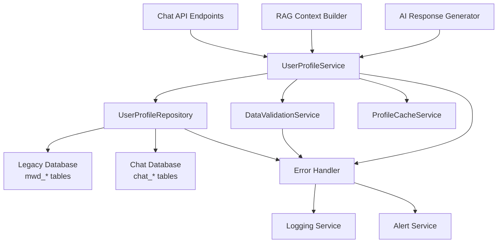

# Design Document

## Overview

This design addresses critical data integrity issues in the aptitude analysis chatbot system where user profile information is inconsistently stored and retrieved between the legacy database (mwd_* tables) and the chat system (chat_users table). The solution implements a unified user profile service that ensures accurate data retrieval, prevents AI hallucination, and provides robust error handling for data inconsistencies.

## Architecture

### Current System Issues

1. **Data Fragmentation**: User demographic data exists in `mwd_person` table but is not properly synchronized with `chat_users` table
2. **Inconsistent Identifiers**: The `anp_seq` (answer progress sequence) serves as the primary link between systems but is not consistently used
3. **AI Hallucination**: When user data is missing, the AI generates fictional demographic information instead of acknowledging data unavailability
4. **Poor Error Handling**: Database query failures result in silent errors or generic responses

### Proposed Architecture



## Components and Interfaces

### 1. UserProfileService

**Purpose**: Central service for all user profile operations with data validation and error handling.

**Interface**:
```python
class UserProfileService:
    async def get_user_profile(self, anp_seq: int) -> UserProfile
    async def get_user_demographics(self, anp_seq: int) -> UserDemographics
    async def validate_user_data(self, anp_seq: int) -> ValidationResult
    async def sync_user_data(self, anp_seq: int) -> SyncResult
    async def get_cached_profile(self, anp_seq: int) -> Optional[UserProfile]
    async def invalidate_cache(self, anp_seq: int) -> None
```

**Key Features**:
- Unified data access across legacy and chat systems
- Automatic data validation and consistency checks
- Intelligent caching with TTL and invalidation
- Comprehensive error handling with retry logic
- Audit logging for all operations

### 2. UserProfileRepository

**Purpose**: Data access layer that handles complex joins between legacy and chat databases.

**Interface**:
```python
class UserProfileRepository:
    async def get_demographics_by_anp_seq(self, anp_seq: int) -> Optional[UserDemographics]
    async def get_education_background(self, anp_seq: int) -> Optional[EducationInfo]
    async def get_professional_background(self, anp_seq: int) -> Optional[ProfessionalInfo]
    async def update_chat_user_profile(self, anp_seq: int, profile_data: Dict) -> bool
    async def verify_data_consistency(self, anp_seq: int) -> ConsistencyReport
```

**Implementation Details**:
- Uses optimized SQL queries with proper joins
- Handles connection pooling and transaction management
- Implements circuit breaker pattern for database failures
- Provides detailed error context for debugging

### 3. DataValidationService

**Purpose**: Validates user profile data integrity and identifies inconsistencies.

**Interface**:
```python
class DataValidationService:
    def validate_demographics(self, demographics: UserDemographics) -> ValidationResult
    def validate_education_data(self, education: EducationInfo) -> ValidationResult
    def validate_professional_data(self, professional: ProfessionalInfo) -> ValidationResult
    def check_data_completeness(self, profile: UserProfile) -> CompletenessReport
```

### 4. Enhanced RAG Integration

**Modified Context Builder**:
- Integrates with UserProfileService for accurate user data
- Includes user demographics in context when relevant
- Handles missing data gracefully without hallucination

**Modified Response Generator**:
- Uses validated user profile data in responses
- Explicitly states when information is unavailable
- Provides accurate demographic information when available

## Data Models

### UserProfile
```python
@dataclass
class UserProfile:
    anp_seq: int
    user_id: UUID
    demographics: Optional[UserDemographics]
    education: Optional[EducationInfo]
    professional: Optional[ProfessionalInfo]
    data_completeness: float  # 0.0 to 1.0
    last_updated: datetime
    validation_status: ValidationStatus
```

### UserDemographics
```python
@dataclass
class UserDemographics:
    name: str
    age: Optional[int]
    gender: Optional[str]
    birth_date: Optional[str]
    email: Optional[str]
    data_source: str  # 'mwd_person', 'chat_users', 'merged'
    confidence_level: float
```

### EducationInfo
```python
@dataclass
class EducationInfo:
    education_level: Optional[str]
    school_name: Optional[str]
    school_year: Optional[str]
    major: Optional[str]
    data_source: str
```

### ProfessionalInfo
```python
@dataclass
class ProfessionalInfo:
    job_status: Optional[str]
    company_name: Optional[str]
    job_title: Optional[str]
    data_source: str
```

### ValidationResult
```python
@dataclass
class ValidationResult:
    is_valid: bool
    errors: List[ValidationError]
    warnings: List[ValidationWarning]
    confidence_score: float
    data_quality_metrics: Dict[str, Any]
```

## Error Handling

### Error Classification

1. **Data Not Found Errors**
   - User with anp_seq doesn't exist
   - Partial data missing (e.g., no demographics)
   - Handle gracefully with specific error messages

2. **Data Inconsistency Errors**
   - Mismatched data between tables
   - Invalid data formats or values
   - Log for administrative review

3. **Database Connection Errors**
   - Connection timeouts or failures
   - Implement retry with exponential backoff
   - Fallback to cached data when available

4. **Validation Errors**
   - Invalid anp_seq format
   - Data integrity violations
   - Return structured error responses

### Error Response Strategy

```python
class ProfileErrorHandler:
    async def handle_missing_data(self, anp_seq: int, missing_fields: List[str]) -> ErrorResponse
    async def handle_inconsistent_data(self, anp_seq: int, inconsistencies: List[str]) -> ErrorResponse
    async def handle_database_error(self, error: Exception, operation: str) -> ErrorResponse
    async def log_error_for_admin(self, error: ProfileError) -> None
```

### AI Response Guidelines

When user profile data is missing or incomplete:

1. **Explicit Acknowledgment**: "죄송하지만, 현재 제공된 검사 결과에는 나이와 성별 정보가 포함되어 있지 않습니다."

2. **Available Data Focus**: Redirect to available information like test results and aptitude analysis

3. **No Fabrication**: Never generate fictional demographic information

4. **Helpful Alternatives**: Suggest contacting support or retaking assessment if needed

## Testing Strategy

### Unit Tests

1. **UserProfileService Tests**
   - Test data retrieval with various anp_seq values
   - Test error handling for missing data
   - Test caching behavior and invalidation
   - Test data validation logic

2. **UserProfileRepository Tests**
   - Test database queries with mock data
   - Test connection error handling
   - Test data consistency checks
   - Test transaction rollback scenarios

3. **DataValidationService Tests**
   - Test validation rules for each data type
   - Test edge cases and boundary conditions
   - Test error message generation
   - Test completeness scoring

### Integration Tests

1. **End-to-End Profile Retrieval**
   - Test complete user profile retrieval flow
   - Test with various data completeness scenarios
   - Test error propagation through the stack

2. **RAG System Integration**
   - Test AI responses with accurate user data
   - Test AI responses with missing user data
   - Test context building with profile information

3. **Database Integration**
   - Test with real database connections
   - Test concurrent access scenarios
   - Test data synchronization between systems

### Performance Tests

1. **Load Testing**
   - Test profile service under high concurrent load
   - Test database query performance
   - Test cache effectiveness under load

2. **Stress Testing**
   - Test system behavior with database failures
   - Test memory usage with large datasets
   - Test recovery after system failures

## Implementation Phases

### Phase 1: Core Infrastructure (Week 1-2)
- Implement UserProfileService with basic functionality
- Create UserProfileRepository with essential queries
- Set up data models and validation framework
- Implement basic error handling

### Phase 2: Data Integration (Week 2-3)
- Implement complex database queries for user data
- Add data consistency checking
- Implement caching layer
- Add comprehensive logging

### Phase 3: RAG Integration (Week 3-4)
- Integrate UserProfileService with RAG system
- Update AI response generation logic
- Implement anti-hallucination measures
- Add user data context to AI responses

### Phase 4: Monitoring and Optimization (Week 4-5)
- Add comprehensive monitoring and alerting
- Optimize database queries and caching
- Implement automated data quality checks
- Add administrative tools for data management

## Security Considerations

1. **Data Privacy**
   - Ensure user demographic data is properly protected
   - Implement access controls for sensitive information
   - Log access to personal information for audit trails

2. **Input Validation**
   - Validate all anp_seq inputs to prevent injection attacks
   - Sanitize user data before database operations
   - Implement rate limiting for profile access

3. **Error Information Disclosure**
   - Avoid exposing internal system details in error messages
   - Log detailed errors internally while returning generic messages to users
   - Implement proper error sanitization

## Monitoring and Alerting

### Key Metrics

1. **Data Quality Metrics**
   - Percentage of users with complete profile data
   - Data consistency error rates
   - Profile retrieval success rates

2. **Performance Metrics**
   - Profile service response times
   - Database query performance
   - Cache hit rates

3. **Error Metrics**
   - Profile not found error rates
   - Database connection error rates
   - Data validation failure rates

### Alerting Rules

1. **Critical Alerts**
   - Profile service unavailable (>5% error rate)
   - Database connection failures (>10% of requests)
   - Data consistency errors affecting >1% of users

2. **Warning Alerts**
   - Increased profile retrieval latency (>2s average)
   - Cache miss rate >20%
   - Data completeness below 80% for new users

## Migration Strategy

### Data Migration
1. **Audit Current Data**: Analyze existing data quality and completeness
2. **Backfill Missing Data**: Identify and populate missing chat_users records
3. **Data Cleanup**: Fix known data inconsistencies
4. **Validation**: Verify data integrity after migration

### Deployment Strategy
1. **Feature Flags**: Use feature flags to gradually roll out new profile service
2. **A/B Testing**: Compare old vs new profile handling for subset of users
3. **Monitoring**: Closely monitor error rates and performance during rollout
4. **Rollback Plan**: Maintain ability to quickly revert to old system if needed