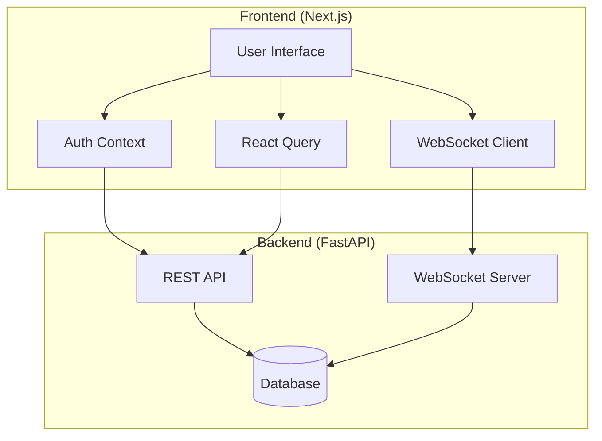

# Design Document

## Overview

This document outlines the technical design for the AI 적성 분석 챗봇 frontend application. The system is a Next.js-based web application that provides an interactive chat interface for aptitude analysis, integrating with a FastAPI backend through REST APIs and WebSocket connections. The application emphasizes security, real-time communication, and user experience.

## Architecture

### High-Level Architecture



### Technology Stack

- **Framework**: Next.js 14+ with App Router
- **Language**: TypeScript (strict mode)
- **Styling**: Tailwind CSS
- **State Management**: React Query + React Context
- **Real-time**: WebSocket API + Server-Sent Events
- **Testing**: Vitest (unit) + Playwright (E2E)
- **Build Tool**: Next.js built-in bundler

### Project Structure
### 프로젝트 폴더 C:\dev_chatbot\octagnonsis_chatbot\front
```
src/
├── app/                    # Next.js App Router pages
│   ├── (auth)/
│   │   └── login/         # Login page
│   ├── (protected)/       # Protected routes group
│   │   ├── chat/          # Chat interface
│   │   ├── history/       # Conversation history
│   │   ├── profile/       # User profile
│   │   ├── documents/     # Document management
│   │   └── etl/           # ETL monitoring
│   ├── layout.tsx         # Root layout
│   └── globals.css        # Global styles
├── components/            # Reusable components
│   ├── ui/               # Base UI components
│   ├── auth/             # Authentication components
│   ├── chat/             # Chat-related components
│   ├── etl/              # ETL monitoring components
│   └── layout/           # Layout components
├── lib/                  # Utilities and configurations
│   ├── api.ts            # API client configuration
│   ├── auth.ts           # Authentication utilities
│   ├── websocket.ts      # WebSocket client
│   └── types.ts          # TypeScript type definitions
├── hooks/                # Custom React hooks
├── providers/            # Context providers
└── middleware.ts         # Next.js middleware for auth
```

## Components and Interfaces

### Authentication System

#### AuthProvider Component
```typescript
interface AuthContextType {
  user: AuthUser | null;
  login: (credentials: LoginCredentials) => Promise<void>;
  logout: () => void;
  isLoading: boolean;
  isAuthenticated: boolean;
}

interface AuthUser {
  id: string;
  name: string;
  type: 'personal' | 'organization_admin' | 'organization_member';
  ac_id?: string;
  sex?: string;
  isPaid?: boolean;
  productType?: string;
  isExpired?: boolean;
  state?: string;
  sessionCode?: string;
  ins_seq?: number;
}
```

**Design Decisions:**
- Use React Context for global authentication state
- Implement secure token storage with httpOnly cookies as primary option
- Automatic token refresh and 401 handling
- Session validation on app initialization

#### Login Component
```typescript
interface LoginFormData {
  username: string;
  password: string;
  loginType: 'personal' | 'organization';
  sessionCode?: string;
}
```

**Features:**
- Tab-based interface for personal/organization login
- Conditional sessionCode field for organization login
- Form validation with real-time feedback
- Error handling with field-specific messages

### Chat System

#### ChatBox Component
```typescript
interface ChatMessage {
  id: string;
  type: 'user' | 'assistant';
  content: string;
  timestamp: Date;
  confidence_score?: number;
  processing_time?: number;
  retrieved_documents?: DocumentReference[];
  conversation_id?: string;
}

interface WebSocketState {
  status: 'connecting' | 'connected' | 'disconnected' | 'error';
  lastError?: string;
  reconnectAttempts: number;
}
```

**Design Decisions:**
- WebSocket-first approach with HTTP fallback
- Exponential backoff for reconnection attempts
- Rate limiting protection with UI feedback
- Real-time typing indicators and status updates

#### Document Panel Component
```typescript
interface DocumentReference {
  id: string;
  type: string;
  title: string;
  preview: string;
  relevance_score: number;
}
```

**Features:**
- Collapsible side panel for retrieved documents
- Document preview with relevance scoring
- Responsive design for mobile devices

### ETL Monitoring System

#### ETLJobs Component
```typescript
interface ETLJob {
  job_id: string;
  status: 'pending' | 'running' | 'completed' | 'failed' | 'cancelled';
  progress: number;
  current_step: string;
  estimated_completion_time?: string;
  error_message?: string;
  created_at: string;
  updated_at: string;
}

interface SSEConnection {
  eventSource: EventSource | null;
  isConnected: boolean;
  reconnectAttempts: number;
}
```

**Design Decisions:**
- Server-Sent Events for real-time progress updates
- Job status visualization with progress bars
- Action buttons for retry/cancel operations
- Automatic reconnection for SSE connections

### User Management

#### ProfileCard Component
```typescript
interface UserProfile {
  user_id: string;
  document_count: number;
  conversation_count: number;
  available_document_types: string[];
  last_conversation_at?: string;
  processing_status: 'none' | 'pending' | 'completed' | 'failed';
}
```

#### DocumentsGrid Component
```typescript
interface UserDocument {
  id: string;
  doc_type: string;
  title: string;
  preview: DocumentPreview;
  created_at: string;
  updated_at: string;
}

interface DocumentPreview {
  primary_tendency?: string;
  top_skills?: string[];
  top_jobs?: string[];
  summary?: string;
}
```

## Data Models

### API Response Types

```typescript
// Authentication
interface LoginResponse {
  user: AuthUser;
  tokens: {
    access: string;
    refresh: string;
  };
  expires_at: string;
}

// Chat
interface ChatResponse {
  conversation_id: string;
  response: string;
  retrieved_documents: DocumentReference[];
  confidence_score: number;
  processing_time: number;
  timestamp: string;
}

interface ConversationHistoryResponse {
  conversations: Conversation[];
  total: number;
  page: number;
  limit: number;
}

// ETL
interface ETLJobResponse {
  job_id: string;
  progress_url: string;
  estimated_completion_time: string;
}

// User Management
interface UserDocumentsResponse {
  documents: UserDocument[];
  total: number;
  page: number;
  limit: number;
}
```

### WebSocket Message Types

```typescript
interface WebSocketMessage {
  type: 'question' | 'status' | 'response' | 'error';
  data: any;
  timestamp: string;
}

interface QuestionMessage {
  type: 'question';
  data: {
    question: string;
    conversation_id?: string;
  };
}

interface StatusMessage {
  type: 'status';
  data: {
    status: 'processing' | 'generating' | 'complete';
    progress?: number;
  };
}
```

## Error Handling

### Error Classification

1. **Network Errors**: Connection failures, timeouts
2. **Authentication Errors**: 401 Unauthorized, token expiration
3. **Authorization Errors**: 403 Forbidden, insufficient permissions
4. **Rate Limiting**: 429 Too Many Requests
5. **Validation Errors**: 400 Bad Request, form validation
6. **Server Errors**: 500 Internal Server Error

### Error Handling Strategy

```typescript
interface ErrorHandler {
  handleNetworkError: (error: NetworkError) => void;
  handleAuthError: (error: AuthError) => void;
  handleRateLimit: (error: RateLimitError) => void;
  handleValidationError: (error: ValidationError) => void;
  handleServerError: (error: ServerError) => void;
}
```

**Implementation:**
- Global error boundary for unhandled errors
- React Query error handling with retry logic
- Toast notifications for user feedback
- Automatic logout on authentication failures
- Exponential backoff for rate limiting

## Testing Strategy

### Unit Testing (Vitest)

**Test Coverage Areas:**
- Authentication utilities and hooks
- API client functions
- WebSocket connection management
- Form validation logic
- Component rendering and interactions

**Example Test Structure:**
```typescript
describe('AuthProvider', () => {
  it('should handle login success', async () => {
    // Test login flow
  });
  
  it('should handle token expiration', async () => {
    // Test automatic logout
  });
});
```

### Integration Testing

**Test Scenarios:**
- Complete authentication flow
- Chat message sending and receiving
- ETL job monitoring with SSE
- Document management operations

### End-to-End Testing (Playwright)

**Critical User Journeys:**
1. Login → Chat → Send Question → Receive Response
2. Login → View History → Open Conversation Details
3. Login → ETL Monitoring → View Job Progress
4. Login → Profile → View Documents → Trigger Reprocessing

## Security Considerations

### Token Management

**Storage Strategy:**
1. **Primary**: httpOnly cookies (most secure)
2. **Fallback**: Secure memory storage
3. **Avoid**: localStorage (XSS vulnerability)

**Token Handling:**
- Automatic Bearer token injection in API requests
- Token validation on app initialization
- Secure token refresh mechanism
- Immediate logout on token compromise

### API Security

**Request Security:**
- HTTPS enforcement
- CSRF protection with SameSite cookies
- Request/response validation
- Rate limiting compliance

### Content Security Policy

```typescript
const cspHeader = `
  default-src 'self';
  script-src 'self' 'unsafe-eval' 'unsafe-inline';
  style-src 'self' 'unsafe-inline';
  img-src 'self' blob: data:;
  font-src 'self';
  connect-src 'self' ws: wss:;
  frame-ancestors 'none';
`;
```

## Performance Optimization

### React Query Configuration

```typescript
const queryClient = new QueryClient({
  defaultOptions: {
    queries: {
      staleTime: 5 * 60 * 1000, // 5 minutes
      cacheTime: 10 * 60 * 1000, // 10 minutes
      retry: (failureCount, error) => {
        if (error.status === 401) return false;
        return failureCount < 3;
      },
    },
  },
});
```

### Caching Strategy

**API Response Caching:**
- User profile: 5 minutes stale time
- Conversation history: 2 minutes stale time
- ETL jobs: Real-time updates, no caching
- Documents: 10 minutes stale time

**WebSocket Optimization:**
- Connection pooling
- Message queuing during disconnection
- Automatic reconnection with backoff

### Code Splitting

```typescript
// Lazy load heavy components
const ETLMonitoring = lazy(() => import('./components/etl/ETLMonitoring'));
const DocumentsGrid = lazy(() => import('./components/documents/DocumentsGrid'));
```

## Accessibility

### WCAG 2.1 Compliance

**Implementation:**
- Semantic HTML structure
- ARIA labels and roles
- Keyboard navigation support
- Screen reader compatibility
- Color contrast compliance (4.5:1 ratio)

**Focus Management:**
- Logical tab order
- Focus indicators
- Skip navigation links
- Modal focus trapping

### Responsive Design

**Breakpoints:**
- Mobile: 320px - 768px
- Tablet: 768px - 1024px
- Desktop: 1024px+

**Layout Adaptation:**
- 3-column desktop → stacked mobile
- Collapsible navigation
- Touch-friendly interactions
- Optimized font sizes

## Deployment Configuration

### Environment Variables

```typescript
interface EnvironmentConfig {
  NEXT_PUBLIC_API_BASE: string;
  NEXT_PUBLIC_WS_BASE: string;
  NEXT_PUBLIC_ADMIN_TOKEN?: string;
  NODE_ENV: 'development' | 'production' | 'test';
}
```

### Build Optimization

**Next.js Configuration:**
```typescript
const nextConfig = {
  experimental: {
    appDir: true,
  },
  images: {
    domains: ['api.example.com'],
  },
  env: {
    CUSTOM_KEY: process.env.CUSTOM_KEY,
  },
};
```

This design provides a comprehensive foundation for building a secure, performant, and user-friendly AI aptitude analysis chatbot frontend that meets all the specified requirements while following modern web development best practices.