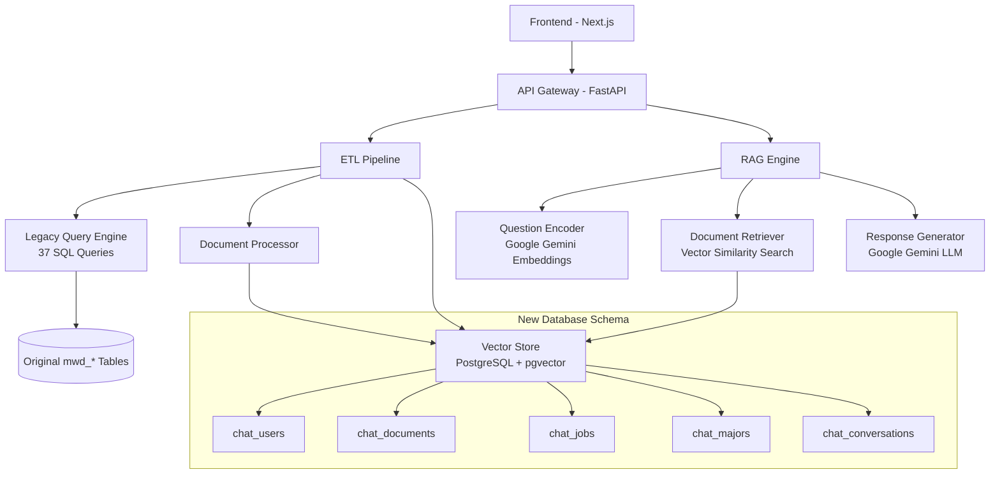

# Design Document

## Overview

The Aptitude Chatbot RAG System transforms a static report-generation system into an intelligent conversational AI that can discuss aptitude test results naturally. The system uses a three-stage architecture: ETL processing of test results into semantic documents, vector-based document retrieval, and LLM-powered response generation. This design leverages existing business logic while introducing modern RAG capabilities for enhanced user interaction.

## Architecture

### High-Level Architecture



### Data Flow Architecture

1. **Test Completion Flow**: User completes test → Background ETL job queued → Documents created and vectorized → Ready for chat
2. **Chat Interaction Flow**: User question → Vector search → Document retrieval → LLM generation → Response delivery
3. **Background Processing**: Uses asyncio-based task management with database job tracking (no Redis/Celery dependencies)

## Background Processing Architecture

The system uses a simplified background processing approach without external dependencies:

### Job Management Strategy
- **In-Memory Task Queue**: Uses asyncio for concurrent task execution
- **Database Job Tracking**: Persists job status and progress in PostgreSQL
- **No External Dependencies**: Eliminates Redis/Celery complexity
- **Graceful Degradation**: System remains functional even if background processing fails

### Job Lifecycle
1. **Job Creation**: ETL jobs created in database with PENDING status
2. **Task Execution**: Background worker picks up jobs and processes them
3. **Progress Tracking**: Job status updated in database (IN_PROGRESS, COMPLETED, FAILED)
4. **Error Handling**: Failed jobs marked for retry with exponential backoff
5. **Cleanup**: Completed jobs archived after configurable retention period

### Scalability Considerations
- **Horizontal Scaling**: Multiple application instances can process jobs concurrently
- **Load Balancing**: Database-based job locking prevents duplicate processing
- **Resource Management**: Configurable concurrency limits prevent resource exhaustion

## Components and Interfaces

### 1. ETL Pipeline Component

**Purpose**: Transform raw test results into semantic documents optimized for RAG

**Key Classes**:
- `ETLOrchestrator`: Orchestrates the entire ETL process with background task management
- `LegacyQueryExecutor`: Wraps existing AptitudeTestQueries class
- `DocumentTransformer`: Converts query results into thematic documents
- `VectorEmbedder`: Generates embeddings using Google Gemini
- `BackgroundTaskManager`: Handles asynchronous processing without external dependencies

**Interface**:
```python
class ETLOrchestrator:
    async def process_test_completion(self, user_id: str, anp_seq: int) -> ProcessingResult
    async def extract_raw_data(self, anp_seq: int) -> Dict[str, Any]
    async def transform_to_documents(self, raw_data: Dict) -> List[Document]
    async def store_documents(self, user_id: str, documents: List[Document]) -> bool
    
class BackgroundTaskManager:
    async def submit_etl_job(self, user_id: str, anp_seq: int) -> str
    async def get_job_status(self, job_id: str) -> JobStatus
    async def cancel_job(self, job_id: str) -> bool
```

### 2. Document Types and Structure

**Document Categories**:
- `PERSONALITY_PROFILE`: Primary and secondary tendencies, detailed traits
- `THINKING_SKILLS`: 8 cognitive abilities with scores and comparisons  
- `CAREER_RECOMMENDATIONS`: Job suggestions based on personality and skills
- `LEARNING_STYLE`: Study methods and academic subject recommendations
- `COMPETENCY_ANALYSIS`: Top 5 talents with percentile rankings
- `PREFERENCE_ANALYSIS`: Image preference test results and related careers

**Document Schema**:
```python
@dataclass
class ChatDocument:
    user_id: str
    doc_type: DocumentType
    content: Dict[str, Any]  # JSON structure specific to doc_type
    summary_text: str        # Text for embedding and search
    embedding_vector: List[float]  # 768-dimensional vector
    metadata: Dict[str, Any] # Additional context and tags
```

### 3. RAG Engine Component

**Purpose**: Handle conversational queries using vector search and LLM generation

**Key Classes**:
- `QuestionProcessor`: Analyzes and categorizes user questions
- `DocumentRetriever`: Performs semantic search using pgvector
- `ContextBuilder`: Constructs prompts from retrieved documents
- `ResponseGenerator`: Interfaces with Google Gemini LLM

**Interface**:
```python
class RAGEngine:
    async def process_question(self, user_id: str, question: str) -> ChatResponse
    async def retrieve_relevant_docs(self, user_id: str, query_vector: List[float]) -> List[Document]
    async def generate_response(self, question: str, context_docs: List[Document]) -> str
```

### 4. Vector Search Component

**Purpose**: Efficient semantic similarity search using PostgreSQL pgvector

**Configuration**:
- Vector dimension: 768 (Google Gemini embedding size)
- Similarity metric: Cosine similarity
- Index type: HNSW for fast approximate search
- Search limit: Top 5 most relevant documents per query

## Data Models

### Database Schema

```sql
-- User management
CREATE TABLE chat_users (
    user_id UUID PRIMARY KEY DEFAULT gen_random_uuid(),
    anp_seq INTEGER UNIQUE NOT NULL,
    name VARCHAR(100) NOT NULL,
    email VARCHAR(255),
    test_completed_at TIMESTAMP NOT NULL,
    created_at TIMESTAMP DEFAULT CURRENT_TIMESTAMP,
    updated_at TIMESTAMP DEFAULT CURRENT_TIMESTAMP
);

-- Document storage with vector embeddings
CREATE TABLE chat_documents (
    doc_id UUID PRIMARY KEY DEFAULT gen_random_uuid(),
    user_id UUID NOT NULL REFERENCES chat_users(user_id),
    doc_type VARCHAR(50) NOT NULL,
    content JSONB NOT NULL,
    summary_text TEXT NOT NULL,
    embedding_vector vector(768) NOT NULL,
    metadata JSONB DEFAULT '{}',
    created_at TIMESTAMP DEFAULT CURRENT_TIMESTAMP,
    updated_at TIMESTAMP DEFAULT CURRENT_TIMESTAMP
);

-- Job and career information
CREATE TABLE chat_jobs (
    job_id UUID PRIMARY KEY DEFAULT gen_random_uuid(),
    job_code VARCHAR(20) UNIQUE NOT NULL,
    job_name VARCHAR(200) NOT NULL,
    job_outline TEXT,
    main_business TEXT,
    embedding_vector vector(768),
    created_at TIMESTAMP DEFAULT CURRENT_TIMESTAMP
);

-- Academic major information  
CREATE TABLE chat_majors (
    major_id UUID PRIMARY KEY DEFAULT gen_random_uuid(),
    major_code VARCHAR(20) UNIQUE NOT NULL,
    major_name VARCHAR(200) NOT NULL,
    description TEXT,
    embedding_vector vector(768),
    created_at TIMESTAMP DEFAULT CURRENT_TIMESTAMP
);

-- Conversation history
CREATE TABLE chat_conversations (
    conversation_id UUID PRIMARY KEY DEFAULT gen_random_uuid(),
    user_id UUID NOT NULL REFERENCES chat_users(user_id),
    question TEXT NOT NULL,
    response TEXT NOT NULL,
    retrieved_doc_ids UUID[] DEFAULT '{}',
    created_at TIMESTAMP DEFAULT CURRENT_TIMESTAMP
);

-- Background job tracking
CREATE TABLE chat_etl_jobs (
    job_id UUID PRIMARY KEY DEFAULT gen_random_uuid(),
    user_id UUID NOT NULL REFERENCES chat_users(user_id),
    anp_seq INTEGER NOT NULL,
    status VARCHAR(20) NOT NULL DEFAULT 'PENDING',
    progress_percentage INTEGER DEFAULT 0,
    error_message TEXT,
    retry_count INTEGER DEFAULT 0,
    max_retries INTEGER DEFAULT 3,
    created_at TIMESTAMP DEFAULT CURRENT_TIMESTAMP,
    started_at TIMESTAMP,
    completed_at TIMESTAMP,
    updated_at TIMESTAMP DEFAULT CURRENT_TIMESTAMP
);

-- Vector similarity search indexes
CREATE INDEX ON chat_documents USING hnsw (embedding_vector vector_cosine_ops);
CREATE INDEX ON chat_jobs USING hnsw (embedding_vector vector_cosine_ops);
CREATE INDEX ON chat_majors USING hnsw (embedding_vector vector_cosine_ops);

-- Job tracking indexes
CREATE INDEX ON chat_etl_jobs (status, created_at);
CREATE INDEX ON chat_etl_jobs (user_id);
CREATE INDEX ON chat_etl_jobs (anp_seq);
```

### Document Content Structures

**Personality Profile Document**:
```json
{
  "primary_tendency": {
    "name": "창의형",
    "code": "tnd12000", 
    "explanation": "새로운 아이디어를 창출하고...",
    "rank": 1,
    "percentage_in_total": 15.2
  },
  "secondary_tendency": {
    "name": "분석형",
    "code": "tnd21000",
    "explanation": "논리적 사고를 통해...",
    "rank": 2,
    "percentage_in_total": 12.8
  },
  "top_tendencies": [
    {"rank": 1, "name": "창의형", "score": 85},
    {"rank": 2, "name": "분석형", "score": 78},
    {"rank": 3, "name": "탐구형", "score": 72}
  ],
  "bottom_tendencies": [
    {"rank": 23, "name": "안정형", "score": 32},
    {"rank": 24, "name": "보수형", "score": 28},
    {"rank": 25, "name": "수동형", "score": 25}
  ]
}
```

## Error Handling

### ETL Pipeline Error Handling

1. **Query Execution Failures**: Log failed queries, continue with available data, mark processing as partial
2. **Document Transformation Errors**: Validate JSON structure, provide default values for missing fields
3. **Vector Embedding Failures**: Retry with exponential backoff, fallback to text-only storage
4. **Database Storage Errors**: Transaction rollback, cleanup partial data, notify administrators
5. **Background Task Failures**: Use in-memory job tracking with database persistence for reliability

### RAG Engine Error Handling

1. **Vector Search Failures**: Fallback to text-based search using PostgreSQL full-text search
2. **LLM API Failures**: Retry with different model parameters, provide cached responses if available
3. **Context Too Large**: Truncate documents intelligently, prioritize most relevant sections
4. **No Relevant Documents**: Inform user gracefully, suggest alternative questions

### Background Processing Error Handling

1. **Job Queue Management**: Use asyncio-based task management with database job tracking
2. **Process Monitoring**: Track job status in database without external dependencies
3. **Failure Recovery**: Implement retry logic with exponential backoff for failed jobs
4. **Resource Management**: Monitor memory usage and implement job throttling

## Testing Strategy

### Unit Testing

- **Document Transformation Logic**: Test each query result → document conversion
- **Vector Operations**: Verify embedding generation and similarity calculations
- **Database Operations**: Test CRUD operations and vector search functionality
- **LLM Integration**: Mock API responses, test prompt construction

### Integration Testing

- **End-to-End ETL**: Complete test result processing from raw data to stored documents
- **RAG Pipeline**: Full question → search → generation → response flow
- **Database Performance**: Vector search performance with realistic data volumes
- **API Endpoints**: FastAPI route testing with various question types

### Performance Testing

- **Vector Search Latency**: Measure search times with different document volumes
- **Concurrent User Load**: Test multiple simultaneous chat sessions
- **ETL Processing Time**: Benchmark document generation for different test types
- **Memory Usage**: Monitor embedding storage and retrieval efficiency

### User Acceptance Testing

- **Question Understanding**: Test chatbot's ability to interpret various question formats
- **Answer Quality**: Evaluate response relevance and accuracy
- **Conversation Flow**: Test multi-turn conversations and context retention
- **Edge Cases**: Handle unusual questions, incomplete test data, system errors