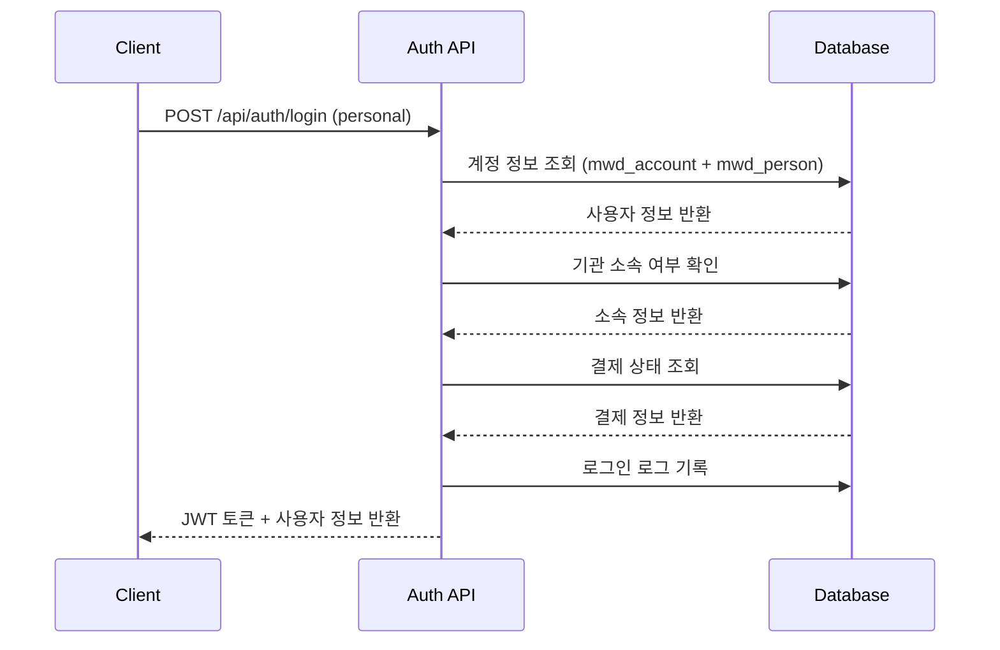
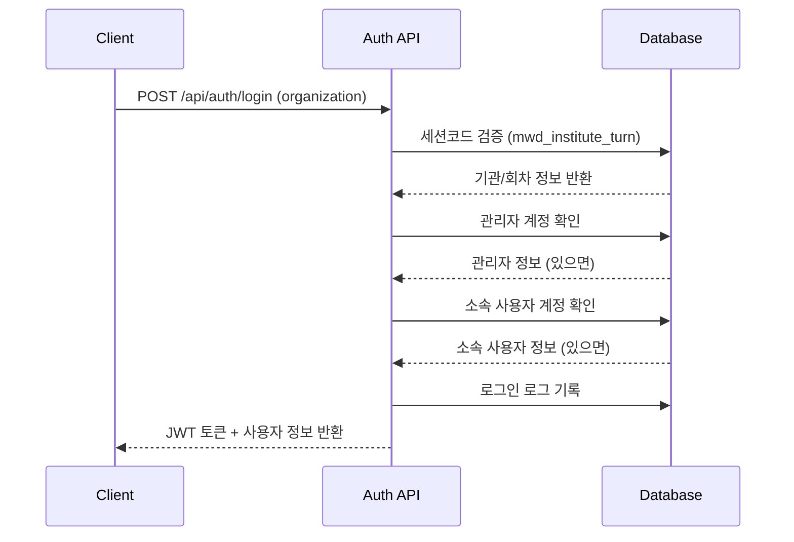

# 인증 시스템 구현 요약

## 개요

NextJS 백엔드의 로그인 로직을 Python FastAPI로 포팅하여 JWT 기반 인증 시스템을 구현했습니다. 기존 데이터베이스 구조와 로직을 그대로 유지하면서 Python 환경에 맞게 최적화했습니다.

## 주요 특징

### 1. 다중 로그인 타입 지원
- **개인 사용자 로그인**: 일반 개인 사용자 계정
- **기관 관리자 로그인**: 기관의 관리자 계정 (pe_seq = -1)
- **기관 소속 사용자 로그인**: 특정 기관/회차에 소속된 사용자

### 2. 보안 기능
- **JWT 토큰 기반 인증**: 상태 없는(stateless) 인증 방식
- **비밀번호 암호화**: PostgreSQL CRYPT 함수 사용 (기존 시스템과 호환)
- **토큰 만료 관리**: 설정 가능한 만료 시간
- **접근 권한 검증**: 사용자별 리소스 접근 제어

### 3. 기존 시스템과의 호환성
- **데이터베이스 스키마**: 기존 테이블 구조 그대로 사용
- **비밀번호 검증**: 기존 CRYPT 방식 유지
- **로그인 로그**: 기존 mwd_log_login_account 테이블 활용
- **사용자 분류 로직**: NextJS와 동일한 사용자 구분 로직

## 구현된 엔드포인트

### 인증 관련 엔드포인트

| 엔드포인트 | 메서드 | 설명 |
|-----------|--------|------|
| `/api/auth/login` | POST | 사용자 로그인 |
| `/api/auth/verify-token` | POST | JWT 토큰 검증 |
| `/api/auth/logout` | POST | 로그아웃 |
| `/api/auth/me` | GET | 현재 사용자 정보 |
| `/api/auth/health` | GET | 인증 서비스 상태 확인 |

### 보호된 엔드포인트

다음 엔드포인트들은 JWT 토큰 인증이 필요합니다:

- `/api/chat/question` - 질문하기
- `/api/chat/history/{user_id}` - 대화 기록 조회
- `/api/chat/feedback` - 피드백 제출
- `/api/users/*` - 사용자 관련 모든 엔드포인트

## 로그인 플로우

### 1. 개인 사용자 로그인



### 2. 기관 사용자 로그인



## 데이터 모델

### LoginRequest
```python
class LoginRequest(BaseModel):
    username: str
    password: str
    loginType: str  # "personal" | "organization"
    sessionCode: Optional[str]  # 기관 로그인 시 필수
```

### LoginResponse
```python
class LoginResponse(BaseModel):
    success: bool
    message: str
    user: Optional[Union[PersonalUserInfo, OrganizationAdminInfo, OrganizationMemberInfo]]
    token: Optional[str]
    expires_at: Optional[str]
```

### 사용자 정보 타입

#### PersonalUserInfo
```python
class PersonalUserInfo(BaseModel):
    id: str  # ac_gid
    name: str  # pe_name
    type: str = "personal"
    sex: str  # pe_sex
    isPaid: bool  # cr_pay == 'Y'
    productType: str  # pd_kind
    isExpired: bool  # expire == 'N'
    state: str  # anp_done
    ac_id: str
```

#### OrganizationAdminInfo
```python
class OrganizationAdminInfo(BaseModel):
    id: str  # ac_gid
    name: str  # ins_manager1_name
    type: str = "organization_admin"
    sessionCode: str
    ac_id: str
    ins_seq: int
```

#### OrganizationMemberInfo
```python
class OrganizationMemberInfo(BaseModel):
    id: str  # ac_gid
    name: str  # pe_name
    type: str = "organization_member"
    sessionCode: str
    ac_id: str
```

## 보안 고려사항

### 1. JWT 토큰 보안
- **시크릿 키**: 환경 변수로 관리, 프로덕션에서 강력한 키 사용 필수
- **만료 시간**: 기본 24시간, 필요에 따라 조정 가능
- **알고리즘**: HS256 사용

### 2. 비밀번호 보안
- **기존 암호화 방식 유지**: PostgreSQL CRYPT 함수 사용
- **SQL 인젝션 방지**: 파라미터화된 쿼리 사용

### 3. 접근 제어
- **사용자별 리소스 접근**: 토큰의 user_id와 요청 user_id 일치 확인
- **관리자 권한**: ADMIN_TOKEN을 통한 관리자 접근 지원

## 환경 설정

### 필수 환경 변수
```bash
# JWT 설정
JWT_SECRET_KEY=your-super-secret-jwt-key-change-in-production
JWT_ALGORITHM=HS256
JWT_EXPIRATION_HOURS=24

# 관리자 설정
ADMIN_TOKEN=admin-test-token-2024
AUTH_DISABLED=false  # 개발 시에만 true로 설정
```

### 의존성 패키지
```bash
# 인증 관련 패키지
PyJWT==2.8.0
passlib[bcrypt]==1.7.4
python-multipart==0.0.6
```

## 테스트

### 자동 테스트 스크립트
```bash
python test_auth_system.py
```

이 스크립트는 다음을 테스트합니다:
- 개인/기관 사용자 로그인
- JWT 토큰 검증
- 보호된 엔드포인트 접근
- 인증 없이 접근 시 401 응답 확인

### 수동 테스트 예시

#### 1. 개인 사용자 로그인
```bash
curl -X POST "http://localhost:8000/api/auth/login" \
  -H "Content-Type: application/json" \
  -d '{
    "username": "testuser",
    "password": "testpass",
    "loginType": "personal"
  }'
```

#### 2. 토큰으로 보호된 엔드포인트 접근
```bash
curl -X GET "http://localhost:8000/api/auth/me" \
  -H "Authorization: Bearer YOUR_JWT_TOKEN"
```

## 향후 개선 사항

### 1. 보안 강화
- **토큰 블랙리스트**: 로그아웃된 토큰 무효화
- **리프레시 토큰**: 장기간 로그인 유지
- **2FA 지원**: 이중 인증 추가

### 2. 기능 확장
- **소셜 로그인**: OAuth 2.0 지원
- **비밀번호 재설정**: 이메일 기반 재설정
- **계정 잠금**: 로그인 실패 시 계정 보호

### 3. 모니터링
- **로그인 시도 추적**: 실패한 로그인 시도 모니터링
- **세션 관리**: 활성 세션 추적 및 관리
- **보안 이벤트 로깅**: 의심스러운 활동 감지

## 결론

NextJS 백엔드의 복잡한 로그인 로직을 Python FastAPI로 성공적으로 포팅했습니다. 기존 데이터베이스 구조와 비즈니스 로직을 그대로 유지하면서 JWT 기반의 현대적인 인증 시스템을 구축했습니다. 

이 시스템은 개인 사용자와 기관 사용자 모두를 지원하며, 기존 시스템과 완전히 호환됩니다. 보안성과 확장성을 고려하여 설계되었으며, 향후 추가 기능 확장이 용이한 구조로 구현되었습니다.